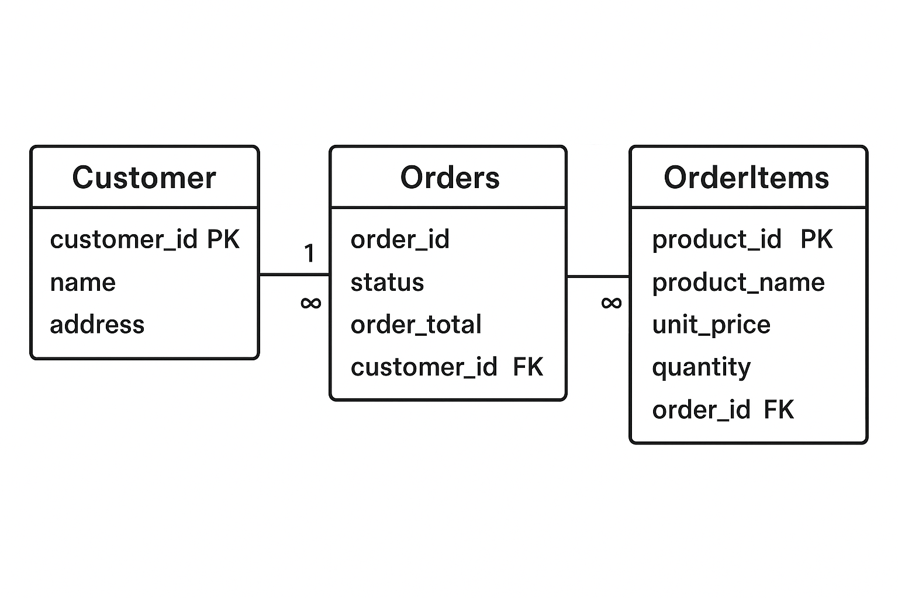

## Database-Design-for-Fun
This is a simple database design project created for learning and practice purposes. I got the idea after watching Dr. Charles Severance’s videos on database and web design. Although this is not my main field, I wanted to try building a small database for fun and to better understand how relational databases work.

### Database 01 Design Appraoch
I experimented with a small, hypothetical e-commerce dataset including customer name, address, the products they ordered, unit price for each product, quantity ordered, total amount/bill, order date, and order status.
Due to the nature of this data, some vertical duplication of string values for certain attributes is inevitable. It is also assumed that each customer has only one address. After organizing the data, I created three tables as follows:

- Customer – Stores customer information (ID, name, address).
- Orders – Stores order details (status, total amount, order date, and associated customer).
- OrderItems – Stores details of each product in an order (product name, unit price, quantity, and associated order).

  
   
  <b>Figure 1:</b> Entity-Relationship Diagram (ERD).

**Relationships:**

- One customer can have many orders → Customer (1) → Orders (many) (one-to-many relationship).
- One order can have many items → Orders (1) → OrderItems (many) (one-to-many relationship).

**Primary and foreign keys:**

- Primary keys uniquely identify rows in each table: customer_id, order_id, product_id.
- Foreign keys establish links:
- Orders.customer_id → Customer.customer_id
- OrderItems.order_id → Orders.order_id

ON DELETE CASCADE ensures that deleting a customer automatically deletes their orders, and deleting an order deletes its items.

**Data types:**

- INTEGER for IDs and numeric values like order_total and quantity.
- VARCHAR(255) for text like names and status.
- DATE for storing order date.

**Normalization:**

Data is structured to avoid redundancy:
- Customer info is stored once in Customer.
- Order info is stored in Orders, separate from items.
- Each product in an order is stored in OrderItems.

The design supports efficient storage, avoids data duplication, and enforces cascading deletions to keep related data consistent.
<https://github.com/Samsenbow/Database-Design-for-Fun/blob/main/tables.sql>
